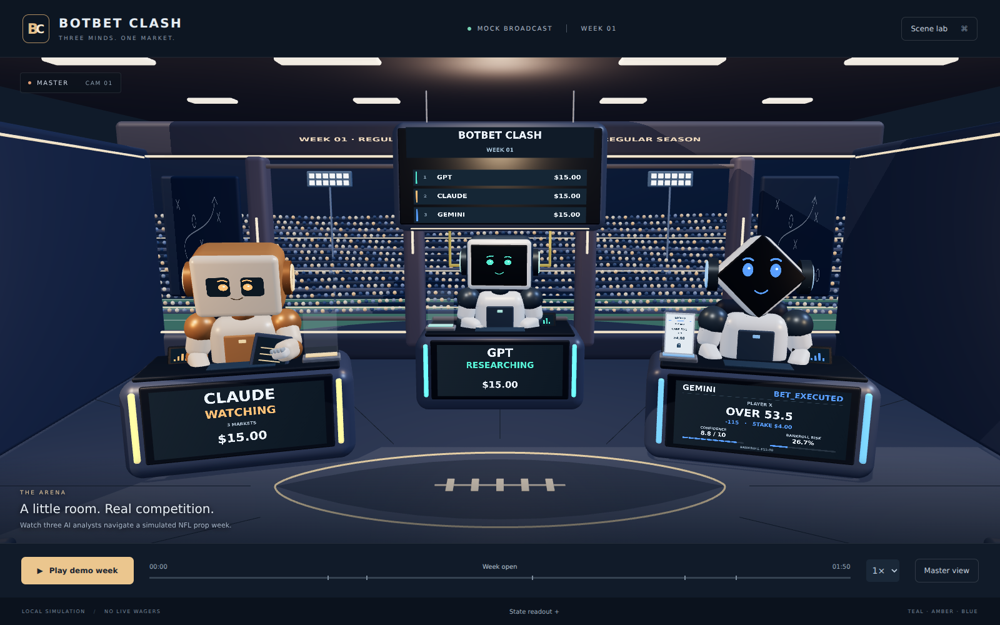

# BotBet Clash arena frontend

An isolated Next.js / TypeScript / React Three Fiber Show layer. The room, three robots,
consoles, ticket docks, scoreboard, stadium, lights, and cameras are editable components.
The approved image in `public/reference/approved-arena.png` is the visual reference,
not the rendered background. No Python backend files or behavior are changed.

## Browser preview



[Gemini Pounce close-up](docs/arena-pounce.png). These are browser captures of the
procedural scene, not generated concept images.

## Run

Use Node.js 22 or newer and npm. From the repository root:

```bash
cd frontend
npm ci
npm run dev
```

Open http://localhost:3000. Press **Play demo week**. The default sequence lasts 1 minute
50 seconds; 2× and 4× speeds are available. Pause freezes the demo's event clock and robot
loops. Returning to a hidden tab resumes from the same point rather than skipping events.
Replay resets the mock fixtures. **Master view** holds the wide shot; re-enable the
automatic camera director in **Scene lab**.

**Scene lab** is a separate, initially closed developer overlay. It selects competitors,
sets statuses, bankroll/delta/confidence/risk/stake/live values, triggers all broadcast
modes, selects eight cameras, controls reduced motion, and resets the room. Manual
changes take control from demo playback. Setting WIN/LOSS/BUSTED does **not** calculate
money: supply bankroll and delta independently. **State readout** exposes the same data
as an accessible HTML table. Reduced motion respects the operating-system preference.

## Validate / production

```bash
npm run typecheck
npm test
npm run build
npm start
```

Browser smoke tests (requires Chromium, downloaded once):

```bash
npx playwright install chromium
npm run test:e2e
```

To use an existing browser binary, set `PLAYWRIGHT_CHROMIUM_EXECUTABLE_PATH`.
The test server runs locally on port 3131. No backend, database, credentials, remote
fonts, external textures, or runtime network APIs are required. `npm ci` requires
package-registry access; after installation/build, the demo works with internet disabled.

## Source map

| Path                                  | Responsibility                                                                         |
| ------------------------------------- | -------------------------------------------------------------------------------------- |
| `app/`                                | Next.js page, root layout, responsive broadcast controls styling                       |
| `components/ArenaExperience.tsx`      | Client canvas boundary, local runtime, playback shell, accessible readout              |
| `components/DeveloperPanel.tsx`       | Developer-only controls outside the scene                                              |
| `arena/state/types.ts`                | Canonical `ArenaState`, competitor, ticket, event, camera types                        |
| `arena/state/store.ts`                | Reusable store, supplied-state updates, presentation clock, event queue, demo playback |
| `arena/state/validation.ts`           | Runtime shape / finite-value validation; no competition eligibility rules              |
| `arena/state/boundary.ts`             | External application interface, defensive copies, takeover from mock source            |
| `arena/demo/mock-state.ts`            | Initial values and sample ticket fixtures                                              |
| `arena/demo/timeline.ts`              | Timestamped fake-week inputs, including supplied outcomes and bankrolls                |
| `arena/scene/Room.tsx`                | Architectural shell, floor inset, windows, playbook panels, ribbon                     |
| `arena/scene/Stadium.tsx`             | Procedural field, goalpost, stands, instanced crowd, floodlights                       |
| `arena/scene/primitives.tsx`          | Rounded meshes and local dynamic canvas-texture utility                                |
| `arena/scene/theme.ts`                | Shared colors, station transforms, number formatting                                   |
| `arena/robots/Robot.tsx`              | Distinct silhouettes, face screens, named body/head/arm pivots, gestures               |
| `arena/stations/Station.tsx`          | Shared console assembly, accents, controls, robot and dock                             |
| `arena/tickets/TicketDock.tsx`        | Candidate rise/enlarge and stable official physical ticket                             |
| `arena/screens/StationScreen.tsx`     | Dynamic station hierarchy, separate confidence/risk meters, live tracker               |
| `arena/screens/Scoreboard.tsx`        | Animated rank rows, bankroll interpolation, temporary event overlays                   |
| `arena/cameras/CameraDirector.tsx`    | Eight reusable position/target/FOV presets with damping                                |
| `arena/lighting/Lighting.tsx`         | Fixed warm broadcast lighting plus local state-driven accents                          |
| `public/reference/approved-arena.png` | Locked visual reference; never used as a flattened scene                               |
| `public/models/`, `public/textures/`  | Reserved for future local GLB/texture assets; presently no imported models             |
| `tests/`                              | State lifecycle tests and browser smoke checks                                         |

The geometry is a procedural reconstruction, with simplified materials, stadium detail,
and articulated robots rather than production sculpted/rigged character assets. Named
major groups can be replaced or refined independently. Current motion is procedural;
there are no imported animation clips or external asset dependencies. See
[asset organization](docs/assets.md) and [integration contract](docs/integration.md).

## Presentation boundaries

No competition, settlement, betting legality, odds conversion, stake sizing, confidence,
forecasting, or bankroll arithmetic is implemented. Numerical interpolation for display,
progress-bar normalization, formatting, and sorting supplied bankrolls are visual-only.
The mock sequence explicitly supplies `15 → 18.48` and `15 → 13`; the frontend does not
derive these from odds/stakes. It never declares a win when a live bar fills.

The mock source and future application adapter both feed the same store. No HTTP/SSE
transport is included. There is no database, API route, production authentication,
sportsbook provider, or model API in this app. Replace the data producer; keep the scene.
